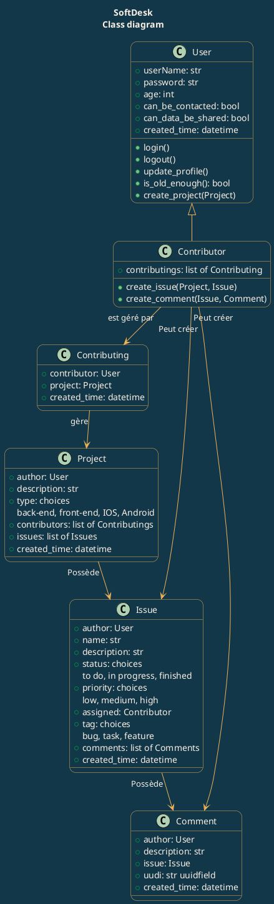

# DaGuinci - SoftDesk

## Installation

* Cloner le depot git

``` bash
git clone git@github.com:DaGuinci/softDesk.git
```

* Créer environnement virtuel :

``` bash
python -m venv env
```

* Activer environnement virtuel :

``` bash
source env/bin/activate
```

* Installer dépendances

``` bash
pip install -r requirements.txt
```

## Exécution

* Lancer le serveur

``` bash
python manage.py runserver
```

## Commandes utiles

* Desactiver environnement virtuel :

``` bash
deactivate
```

* Sauvegarder dépendances

``` bash
pip freeze > requirements.txt
```

* Mettre à jour la base de données

``` bash
python manage.py makemigrations
python manage.py migrate
```

## Todo list

- [x] Initialize project
  - [x] Create Github repository
  - [x] Create local folder with Django
  - [x] Git init in local folder
  - [x] Manage gitignore
  - [x] Manage dependencies
  - [x] Set settings timezone
  - [x] Adapt readme.md
  - [x] Create authentication app
  - [x] Make migrations
  - [x] Git push
  - [x] Create superuser

- [ ] Design project
  - [x] Need analysis
  - [x] Class diagramm
  - [x] Paginate

- [ ] Code project
  - [ ] Create users endpoint
  - [ ] Create first endpoint
  - [ ] Install drf-spectacular
  - [ ] Reecrire contributor en action 'patch' de project

- [ ] Optimize project
  - [ ] Check optimization project document
  - [ ] Check OWASP

- [ ] Test project
  - [ ] Test readme local new install

- [ ] Clean project
  - [ ] Generate flake8 report
  - [ ] Check token duration

## Initialisation des données

### Utilisateurs

* admin-oc
password: password-oc

* string
password: string

* John
password: string

* Ringo
password: string

### Projets

* Premier projet
Propriétaire: string
Contributeurs: John

* Second projet
Propriétaire: Ringo


## Diagrammes classes uml



