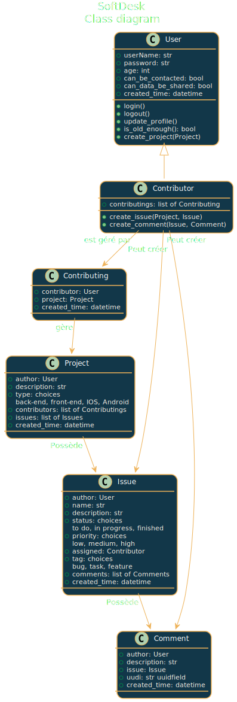

# DaGuinci - SoftDesk

## Installation

* Cloner le depot git

``` bash
git clone git@github.com:DaGuinci/softDesk.git
```

* Entrer dans le repertoire

``` bash
cd softDesk/
```

* Installer pipenv :

``` bash
pip install pipenv
```

* Activer environnement virtuel :

``` bash
pipenv shell
```

* Installer dépendances

``` bash
pipenv install
```

* Créer une base de données
``` bash
python manage.py migrate
```

* Init local dev
``` bash
python manage.py init_local_dev
```

## Exécution

* Lancer le serveur

``` bash
python manage.py runserver
```

* Lister les endpoints disponibles sur un navigateur web  
http://127.0.0.1:8000/docs/swagger-ui/  
*où 8000 est votre port configuré*


## Documentation de l'API

http://127.0.0.1:8000/docs/redoc/  
*où 8000 est votre port configuré*

## Données initialisées

### Utilisateurs

* User 1:  
username: string  
password: string  

* User 2:  
username: Achille  
password: string  

* User 3:  
username: Hector  
password: string  

* User 4:  
username: Ulysse  
password: string  

* Superuser (id 5 ):  
username: Zeus  
password: string  


### Projets

* Projet 1 : Prendre Troie  
*Propiétaire: Achille*  
*Contributeurs: Achille, Ulysse*  
*Possède issue 1 qui possède tous les comments*  

* Projet 2 : Résister aux Grecs  
*Propiétaire: Hector*  
*Contributeurs: Hector*  
*Ne possède pas d'issue*  


## Diagrammes classes uml


